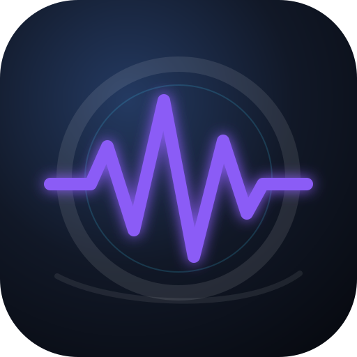

<p align="center"></p>

# CinePulse

**Local AI video enhancement and music-reactive visual studio.**

CinePulse transforma clipes curtos e músicas em vídeos contínuos, melhora vídeos existentes e cria VFX sincronizados com o áudio. O processamento acontece localmente e o usuário escolhe entre velocidade, qualidade e uso de recursos.

> Estado: `1.0.0-rc.1`. O produto está tecnicamente fechado como candidato à versão estável. Real-ESRGAN, RIFE, Demucs e VMAF integram o pipeline principal; os demais modelos detectados são extensões futuras e não são anunciados como funções prontas.

## O que já funciona

- loop de vídeo durante toda a música, removendo o áudio original do clipe;
- vídeo original ou formatos 16:9, 9:16, IMAX digital e Cinema Wide;
- 720p a 12K e 24 a 480 fps, respeitando os limites do hardware e codec;
- preview de 1 a 30 segundos e comparação A/B;
- upscale Lanczos e Real-ESRGAN;
- interpolação FFmpeg, GPU NVIDIA quando disponível e modo CPU;
- interpolação neural RIFE com fallback automático;
- VFX dirigidos opcionalmente por stems do Demucs;
- aurora, espectro, barras, onda, círculo, partículas, pulso e energia musical;
- combinação de efeitos, cor, ocupação, intensidade e foco por faixa musical;
- transições de loop, presets, fila, estimativa de espaço, progresso e relatório final;
- dados, cache, componentes e previews isolados do código-fonte.
- render atômico, recuperação após interrupção e normalização LUFS em duas passagens.

## Início rápido no Windows

1. Instale Python 3.11 ou superior e FFmpeg.
2. Execute `CinePulse.cmd`.
3. Na primeira abertura, o ambiente privado será criado em `.runtime`.

Para reutilizar os componentes da instalação de desenvolvimento existente, sem copiá-los para o Git:

```powershell
.\scripts\Migrate-LocalComponents.ps1 -SourceTools 'G:\edit\tools'
```

Não execute essa migração durante um render importante; ela movimenta vários gigabytes pelo disco.

## Privacidade

O CinePulse não envia vídeos, músicas, nomes de arquivos ou diagnóstico para servidores. Não há telemetria. Downloads opcionais de componentes acessam apenas as fontes mostradas ao usuário. Veja [PRIVACY.md](docs/PRIVACY.md).

## Componentes opcionais

Modelos e binários não ficam neste repositório. O catálogo informa finalidade e licença, e o gerenciador somente aceita download automático quando a versão e o SHA-256 estiverem fixados. Veja [AI_COMPONENTS.md](docs/AI_COMPONENTS.md).

## Limites reais

12K/480 fps é uma opção avançada, não uma promessa para qualquer máquina. O tempo, o tamanho e a compatibilidade dependem de resolução de origem, duração, GPU, VRAM, codec e plataforma de destino. Interpolação não cria detalhe verdadeiro; upscale não recupera informação que não existe na fonte.

## Desenvolvimento

```powershell
py -3 -m venv .venv
.\.venv\Scripts\python -m pip install -e .
.\.venv\Scripts\python -m unittest discover -s tests -v
```

Consulte [CONTRIBUTING.md](CONTRIBUTING.md), [SECURITY.md](SECURITY.md) e o [roadmap](docs/ROADMAP.md).
Os resultados reproduzíveis da versão atual estão em [VALIDATION.md](docs/VALIDATION.md).

Para montar o ZIP portátil reproduzível, depois de abrir o CinePulse ao menos uma vez:

```powershell
.\scripts\Build-Portable.ps1
```

O pacote não inclui modelos. Na primeira abertura, baixa Python e FFmpeg somente se estiverem ausentes, sempre em versões fixadas e verificadas por SHA-256.

Ao publicar no GitHub, use `-Repository 'dono/CinePulse'`; isso ativa no pacote o canal de atualização verificado. O código não presume o nome da sua conta antes da publicação.

## Licença

O código próprio do CinePulse usa a licença MIT. FFmpeg, modelos e ferramentas externas mantêm suas respectivas licenças e não são relicenciados pelo projeto. Consulte [THIRD_PARTY_NOTICES.md](THIRD_PARTY_NOTICES.md) antes de distribuir um pacote.
